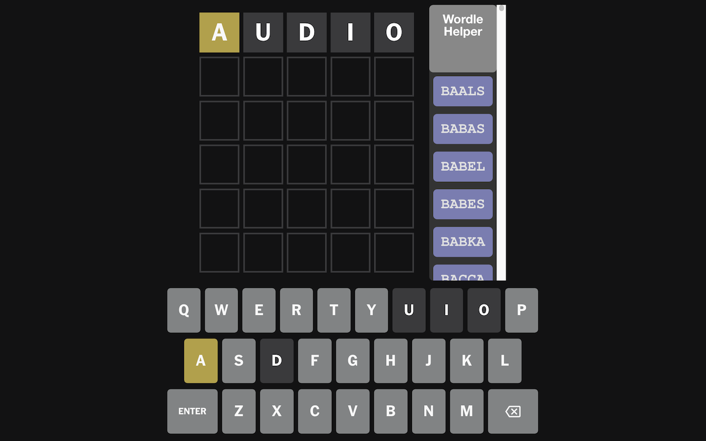
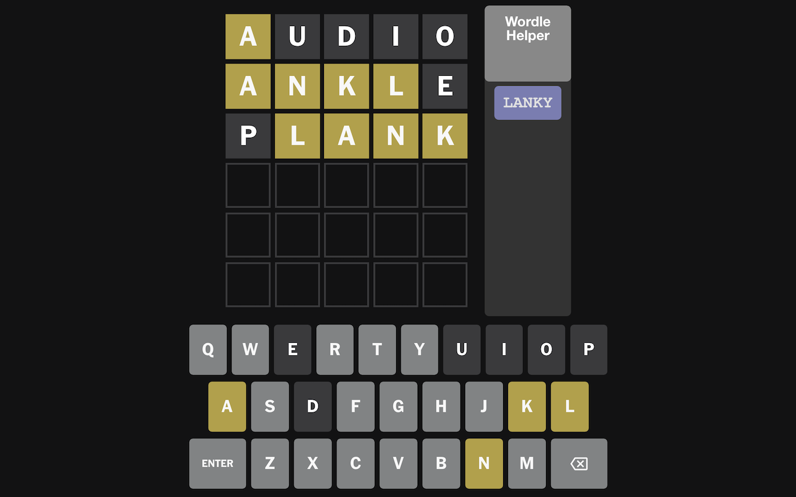

# Wordle-Helper

## Description
This is a Wordle helper for the NYT game, Wordle. It modifies the HTML page to show a list of possible words.

## Usage
|  |  |  |  |  |
|--------------|--------------|--------------|--------------|--------------|
|  |  |  |  |  |

## Change list

This is a list of changes made to the Wordle helper. The changes are listed in reverse chronological order for ease and relevance.

| Version | Description |
|--------------|--------------|
| v1.1.0 | Bug Fixes. Fixed logical error where a letter appears more than once in a guess, but not the actual word. Made sure the enter button on the screen also updated the words, not just hitting enter on a physical keyboard. Addition: Made the word options clickable to autofill the words for you, although it doesn't submit the guess until you decide to press enter. |
| v1.0 | Implemented the basic functionality of the Wordle helper. It can now show a list of possible words based on the letters that are already guessed in a side-by-side scrollable list. |